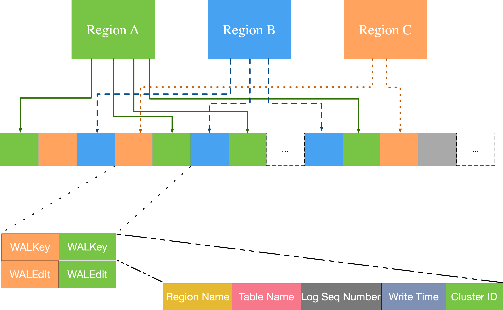
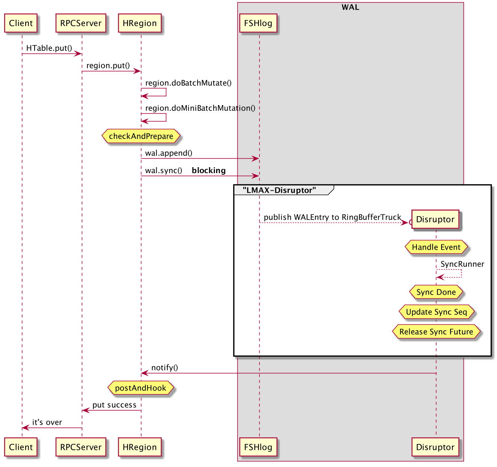
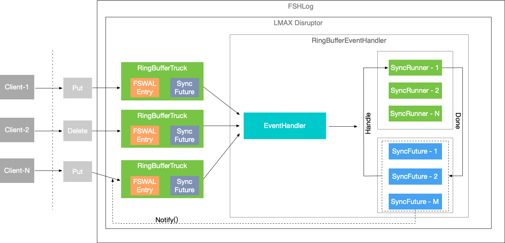
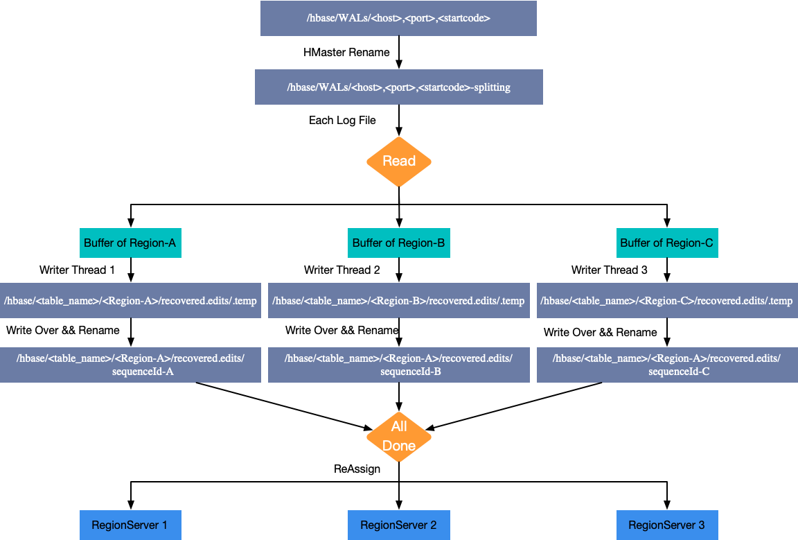
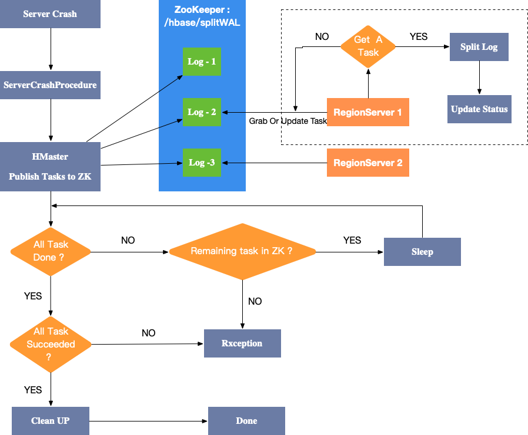

## WAL 作用
众所周知， HBase 可以提供优秀的写数据能力，这与其架构设计是密不可分的。HBase 本身并不会直接将数据写入到磁盘，其数据存储依赖底层的分布式存储系统(HDFS)。假想一下，如果 HBase 客户端写入的每一条数据都要直接调用 HDFS-Client 将数据写入 HDFS，既而写到磁盘（或者写到操作系统的 Page Cache）的话，那么是很难有理想的写入吞吐量的。因此，HBase 选择将数据率先写入到内存，等内存中积累了足够多的数据之后再将数据刷写到磁盘，毫无疑问这样可以极大的提升写入数据的效率，同时还可以缓解底层文件系统的小文件问题。然而一个典型的问题又来了：存储在内存中的数据是不稳定的，一旦 RegionServer 突然宕机，保存在内存中的数据就可能会丢失。
解决这个问题的一个经典方法是对数据的变化过程进行记录并且将记录持久化到磁盘（即 WAL，Write-Ahead-Log，预写日志），假如内存中的数据在被刷写到磁盘之前 RegionServer 出现突然宕机，其他 RegionServer 重新接管相关 region 时，就可以从 WAL 中恢复未来得及刷写到磁盘中的数据，从而保证数据的稳定性和可靠性。
WAL 就是由此而生，在意外情况下保证数据的可靠性是其最大的责任。除此之外，HBase 的集群间数据持续同步时也是基于 WAL 来实现的，与 Mysql 中的 Binlog 颇有几分相似。

## WAL在HBase中的实现
HBase 是基于 Hadoop 开发的 KV 数据库，在实现时充分利用了 Hadoop 中现有的工具，比如 WAL 便是基于 [Hadoop SequenceFile](https://cwiki.apache.org/confluence/display/HADOOP2/SequenceFile) 存储的。 
### hadoop sequence
终归到底，WAl 生成的文件属于记录型日志文件，其中每一行代表一条记录。纯文本并不适合记录二进制类型的数据，而 Hadoop 的 SequenceFile 却是非常适合，其为二进制键值对提供了一个持久化数据结构。将它作为日志文件存储格式时，用户可以根据实际需求选择键和值的类型。HBase 的预写文件采用的就是 SequenceFile 形式。

### WAL Provider
HBase 中关于 WAL 有多种实现（即 ProvideRegionServer），主要是以下几种：
* filesystem： HBase-1.x 版本中默认采用的模式，基于阻塞模式的 DFSClient，并且采用的是经典的串行写入多副本的形式。在实现中使用的是 FSHLog。
* asyncfs： HBase-2.x 版本中默认采用的模式，该模式相对于 filesystem 模式具有更低的写入时间延迟，因为其是基于非阻塞的 DFSClient 实现，可以同时并发写入位于多个 Datanode 上的多个副本。该功能是由小米的同学开发贡献的，具体可参考 [Apache HBase Improements and Practices at Xiaomi](https://www.slideshare.net/HBaseCon/apache-hbase-improvements-and-practices-at-xiaomi)
* multiwal： 从名称中可以看出，multiwal 可以在同一台 RegionServer 上存在多个 filesystem 或者 asyncfs 实例，可以并行写入。对于整个 RegionServer 而言吞吐量是有明显提升的，但是对于单个 Region 而言，吞吐量并不会得到实质性的提升，具体可参考 [Run with > 1 WAL in HRegionServer](https://issues.apache.org/jira/browse/HBASE-5699)。

### FSHLog
FSHLog 是 WAL 的实现类，其核心功能主要有两个： 
* 一个是 walEntry append 功能，即记录变化并追加到 hdfs 文件中；
* 另一个是追踪修改，这个特性通过使用递增的序列号来实现。
其中 WALEntry 主要由 WALKey 和 WALEdit 构成，结构图如下所示：  


### WALkey
前面提到 WAL 采用的是 Hadoop SequenceFile 形式存储， 而 WALKey 就是变更日志键值对中的键值。其中主要包含了 `regionName`， `tablename`， `logSeqNum`，`writeTime` 以及`clusterID`等字段。HBase 中 WALKey 的具体实现类为 HLogKey。  

### WALEdit
WALEdit 则是变更日志键值对中的值，具体是用来表示单个事务中的更新集合。目前主要经历了两个版本的：
1. 在最初的版本中，无法保证行级事务的原子性。假如一次请求中包含了对同一行 R 中 c1， c2， c3 三列数据的修改，那么单个事务总共会有三条修改记录（即三组键值对），如下所示：  
```
<logseq1-for-edit1>:<keyvalue-for-edit-c1>
<logseq2-for-edit2>:<keyvalue-for-edit-c2>
<logseq3-for-edit3>:<keyvalue-for-edit-c3>
```
如果以上三条记录在写完两条时，RegionServer发生了宕机，那么在故障转移时，只能从 WAL 中恢复部分数据，造成数据不一致（与用户希望的不一致）。
2. 在新的版本2中，同一事物中的所有变更信息都集中到单条记录中，这样可以避免上述问题的发生。序列化的格式为：
```
<logseq#-for-entire-txn>:<WALEdit-for-entire-txn>
```
对应上面的举例，WALEdit 部分在新的版本中组织形式如下：  
```
<-1, 3, <Keyvalue-for-edit-c1>, <KeyValue-for-edit-c2>, <KeyValue-for-edit-c3>>
```  
其中 -1 表示的是新的版本，同时可以保持向后兼容。

## HBase中WAL的维护
### WAL持久化级别
在 HBase 中，用户可以根据具体的应用场景来设置WAL的持久化等级，用户可以在每一次 Mutation 请求级别或者 HBase Table 级别设置特定的持久化等级，各等级的大致区别如下所示：  
1. USER_DEFAULT：HBase 默认情况下使用 SYNC_WAL 等级持久化数据。
2. SKIP_WAL：跳过写 WAL 阶段，数据直接写到 memStore 中。优缺点相对明显：
   * 优点 - 这种方式只写内存，所以是可以极大的提升写入性能。
   * 缺点 - 数据的可靠性降低，存在丢数风险。因此在生产环境中一般很少使用。
3. ASYNC_WAL：将数据异步写入 WAL 日志中。client 无需等待数据 Sync 到 HDFS 中，直接返回并对查询可见。Mutation 记录由后台线程后续刷写成 WAL 文件，这种情况下也存在丢数的风险，具体可参考 [HBASE-16689](https：//issues.apache.org/jira/browse/HBASE-16689)。
4. SYNC_WAL：变更记录同步写入 WAL 文件中之后才会通知客户端写入成功。
   * 需要注意的是数据只是被写入文件系统中，可能并没有真正落盘。
5. FSYNC_WAL：变更记录同步写入 WAL 文件，并且强制刷写到磁盘之后才会通知客户端写入成功。这是最严格的日志写入等级，可以保证数据不会丢失，但是性能相对比较差。
   * 在众多 HBase 版本中，FSYNC_WAL 并没有得到实现，而是提供与 SYNC_WAL 相同的持久级别(例如 version ：HBase-1.1.2).

### WAL 文件滚动
HBase RegionServer 启动时会启动一个后台线程（LogRoller）来负责滚动生成 WAL 文件。可以通过参数 `hbase.RegionServer.logroll.period` 指定滚动生成文件的周期。因此 WAL 单个文件并不会过于庞大，配合 WAL 文件过期和清理机制，WAL 文件的数量也不会过多，有助于在发生服务宕机后进行快速恢复。

### WAL 文件失效
当 Region 中 memStore 数据写入满足一定条件之后就会刷写到文件系统(磁盘)，因此只要一个 WAL 文件中所包含的所有数据都已经从 memStore 刷写到了磁盘，那么这个 WAL 文件最大的使命就算是完成了（可以理解为失效了）。WAL 文件中的变更记录是否失效是通过 SequenceId 来进行判断的：如果一台 RegionServer 上所有的 region 已经刷写到磁盘的数据对应的最大 SequenceId 都大于其存在于 WAL 中最大的 SequenceId 的话（有点绕=_=!），那么这个 WAL 文件就可以认为是失效的，可以移动到文件夹 `/oldWALs` 中。

### WAL 文件清理
WAL 文件的清理工作是由 HMaster 启动的后台线程负责的，可以通过配置 `hbase.master.cleaner.interval` 项来指定清理检查间隔(TODO)。

## WAL写入
在介绍 WAL 写入之前，需要简单提一下 HBase Client 的常用使用方式，借此来了解 WAL 的来源之处。  
### HBase 数据写入
HBase Client 提供了非常简洁且丰富的 API：  
* 简洁指的是用户操作模式简单，仅支持`Put`、`Delete`、`Get` 和 `Scan` 四种核心操作。其中前两种操作对应 HBase 的写操作，会引起数据的变化，相应的请求也会计入 WAL。而后两种操作对应 HBase 的读操作，不会添加到 WAL 中。  
* 丰富指的是每一种核心操作都有多种变化，例如对于 `Delete`，既可以删除 `Family`，也可以删除 `Qualifier`，还可以删除指定版本的数据。其余操作也可以配置多种选项。  
当用户向 RegionServer 发起 `Mutate` 请求时， 会将请求交给对应的 HRegion 进行处理，常规情况下会写到由 `FSHlog` 实现的 WAL 中，一旦数据被写入到 WAL 中，数据就会被写到 `memstore` 中，同时还会检查 `memstore` 之中的数据是否已经写满，如果满了则会将数据刷写到磁盘进行持久化（先写 `WAL` 还是先写 `memstore` 在不同的 HBase 版本中实现不尽相同）。  

`Mutate` 类型的操作都会产生相应的 WAL，客户端调用 `Htable.put()` 之后关于 WAL 写入方面的流程大致如下（参考 HBase-1.1.2）：


具体的 WAL 的写入模型：  

WAL 的写入可以分为三个阶段： 
1. 将变更数据对封装成 WALEntry 写入本地缓存，这一阶段是多线程写入缓存，每条修改记录会绑定唯一递增的 SequenceID。
2. 将本地缓存写入文件系统，单个线程消费缓存中的数据并执行文件系统写入操作。
3. 执行 sync 操作同步到磁盘，实际是由多线程批量执行，可以极大提高 WAL 写入效率。

## WAL split
当 HMaster 认为 RegionServer 出现意外宕机，例如 RegionServer 出现长时间 GC、机器断电等情况。HMaster 会启动恢复机制，需要从 WAL 中对位于该 RegionServer 的 Regions 进行数据恢复，以下是 HBase 初期阶段的恢复流程示意图：

1. 将对应的region server的 WAL 目录重命名。可以妥善处理 master 认为 RegionServer 已经挂掉但实际上 RegionServer 还存活并提供服务的情况，例如长时间 FULL GC 可能导致 RegionServer 与 Zookeeper 连接超时，HMaster 认为 RegionServer 出现意外情况，如果不采取命名措施的话，RegionServer 恢复之后可能还会继续向该目录刷下 WAL 文件。
2. 启动单个线程依次顺序读取每个 WAL 文件，并将读取出的 WALEntry 数据按照 WALKey 中携带的 Region 信息在内存中进行分组缓存，最终将文件中的变更信息按照 Region 进行分组汇总。
3. 启动多个线程来将内存中缓存的数据写入 HDFS 中，等 WAL 文件全部读取分组完成之后，将文件目录名改为 SequenceID，该 SequenceID 指的是写入到文件中的第一条变更信息对应的 SequenceID（即最小的 SequenceID）。只要相应 Region 最新生成的 HFile 中最大的 SeqID 大于或者等于该 SequenceID，那么就可以认为数据得到了完全恢复。
4. Split 完毕之后，HMaster 将 Region 分配给新的 RegionServer，在新的 RegionServer 重新打开 region 时会通过相应目录中的 WAL 文件恢复数据，所有数据恢复之后会被刷写到磁盘中，并对相应的 WAL 文件进行清理。
5. 完成数据恢复。  

以上流程虽然简单，但是效率比较低下，尤其是在多台 RegionServer 同时出现的情况下，WAL Split 的时间会变得很长，受影响的 Region 不可服务时间也会加长，这在生产环境中是及其惨重的！于是衍生出来了其分布式版本：  

1. Master 认为 RegionServer 宕机之后会触发恢复机制，将需要切分日志路径发布到Zookeeper节点上，每个日志作为一个任务，每个任务都会有对应状态。
2. 所有 RegionServer 在启动时都会监听 Zookeeper 上的这个路径，Master 将任务发布到 ZK 上，由各 RegionServer 抢占并执行切分任务
3. RegionServer 抢占任务成功之后变进行 WAL 文件切分，并且根据处理结果更新该任务对应 ZK 节点状态。
4. Master 会一直监听在该 ZK 节点上，一旦发生状态修改就会得到通知。如果任务执行成功，则相应的节点就会被删除，如果执行失败，则可重新发布。  

但是！如果集群中出现大规模的服务宕机，那么在进行任务发布时就会对 Zookeeper 造成很大的压力。后续的版本中可能会在这部分逐步摆脱 ZooKeeper 的依赖，可以参考 [Procedure V2 - Distributed Log Splitting](https：//issues.apache.org/jira/browse/HBASE-20610)
